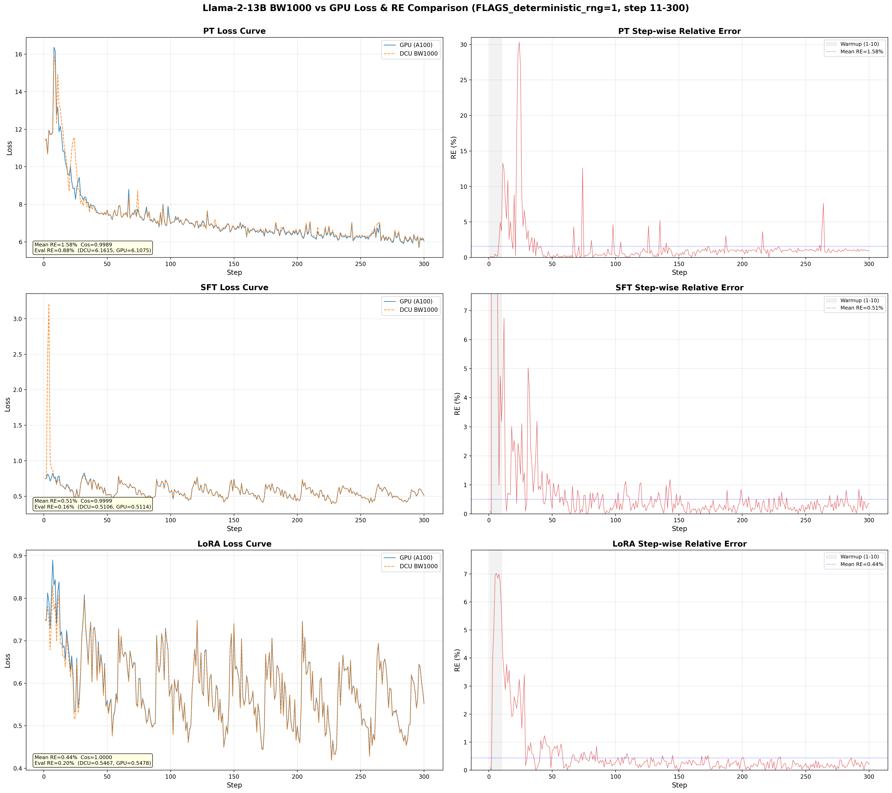
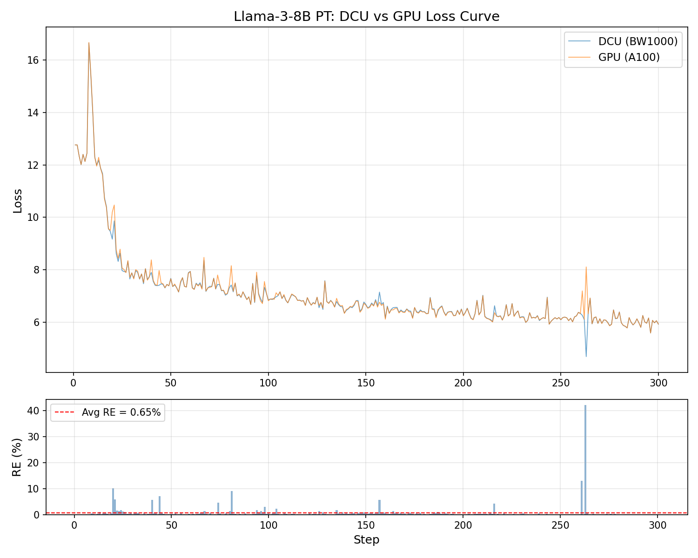
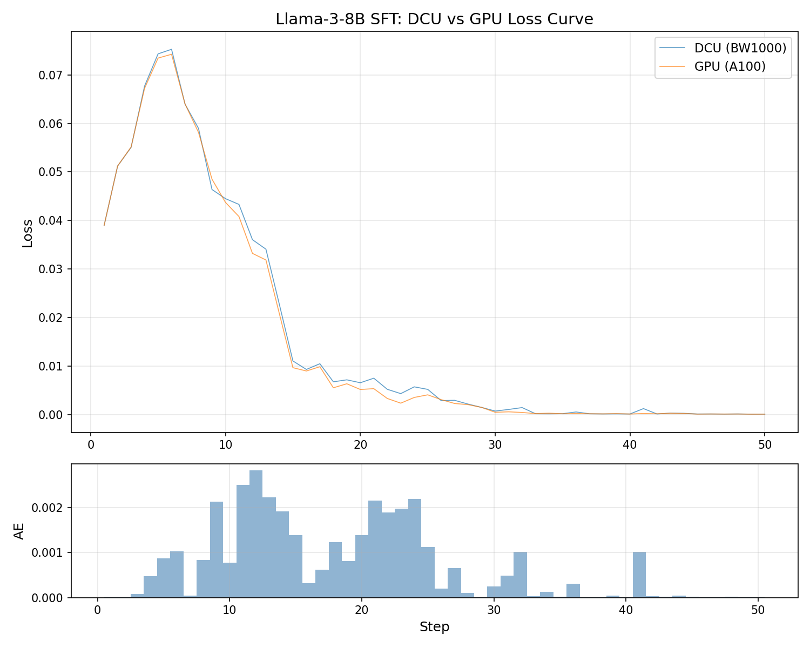
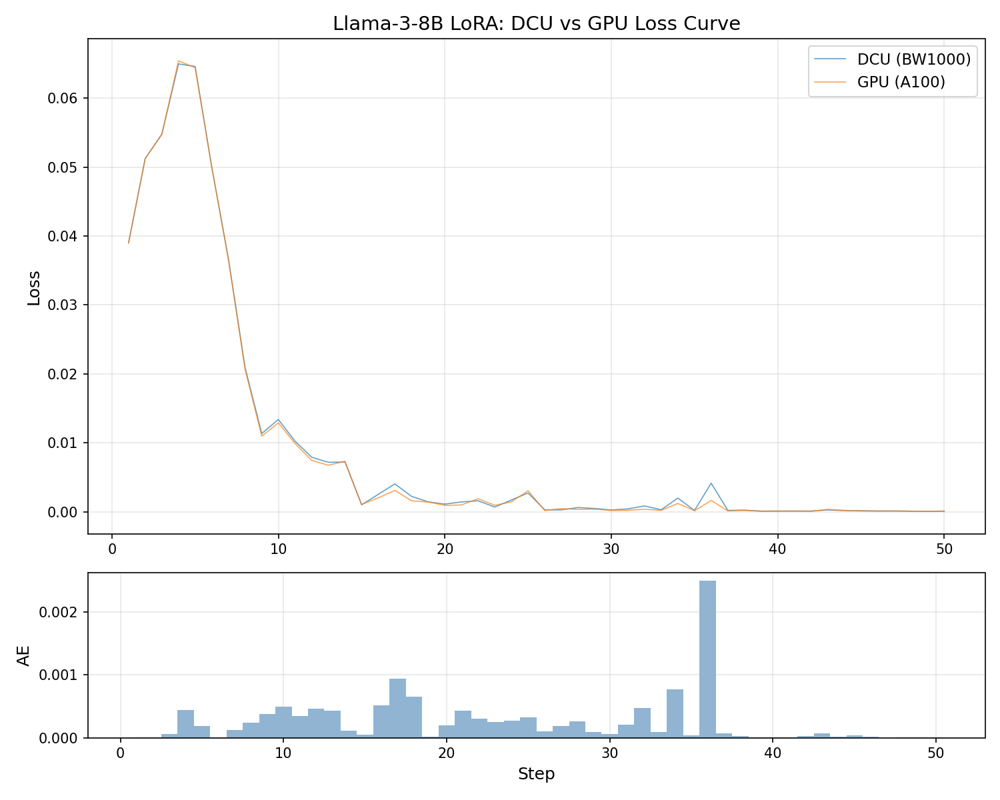

# 曙光2030项目进展总结

## 指标完成情况

| 指标 | 要求 | 完成状态 |
|:-----|:-----|:--------:|
| **1.5** 大模型训练能力 | 千卡 BW1000 上支持十亿到千亿参数模型的预训练及微调 | ✅ 已验证 8B/13B，100B 方案就绪 |
| **1.6** 弹性扩缩容 | 百卡→千卡弹性扩容，支持千亿模型训练中动态扩缩 | ✅ 机制已验证（8B: 2机→4机），待更大集群验证 |
| **1.5** 100B 千亿参数 | 千亿模型预训练 | 🔲 待更大集群执行 |
| **1.6** 百卡→千卡弹性 | 百卡→千卡扩缩容 | 🔲 待更大集群验证 |

---

## 指标 1.5：大模型训练能力

> 国产深度学习框架具备千卡海光 BW1000 芯片的大模型训练能力，支持十亿到千亿级参数规模的语言大模型预训练及微调

**验证模型选择**：采用 Llama-2 作为验证载体，因其架构公开、GPU 基线可对标，便于量化 DCU 训练精度。所验证的分布式并行、弹性扩缩容、精度对齐等能力与模型架构无关，可迁移至 Qwen、Llama-3 等新架构模型。

### 已完成验证（Llama-2-13B）

| 模型 | 参数量 | 训练任务 | 卡数 | 并行策略 | 精度（vs GPU） |
|:----:|:------:|:--------:|:----:|:--------:|:-------------:|
| Llama-2-13B | ~13B | PT / SFT / LoRA | 4 | TP=2, PP=2 | PT 0.93%，SFT 0.51%，LoRA 0.44% |

- 精度对齐达标：与 GPU(A100) PT 稳态相对误差 <1%（Llama-2-13B 0.93%）

  

### Llama-3-8B 精度验证

在 Llama-2 验证基础上，进一步完成 Llama-3-8B 的 PT / SFT / LoRA 全任务精度验证。

| 模型 | 参数量 | 训练任务 | 卡数 | 并行策略 | 精度（vs GPU） |
|:----:|:------:|:--------:|:----:|:--------:|:-------------:|
| Llama-3-8B | ~8B | PT | 4 | TP=2, PP=2 | 稳态 RE 0.59% |
| Llama-3-8B | ~8B | SFT | 4 | TP=2, PP=2 | 平均 AE 0.0095 |
| Llama-3-8B | ~8B | LoRA | 4 | TP=2, PP=2 | 平均 AE 0.0046 |

**PT（预训练）**：DCU 与 GPU loss 曲线高度重合，稳态（step≥50）平均相对误差 0.59%，优于 Llama-2-13B 的 0.93%



**SFT（指令微调）**：loss 量级极小（~10⁻³），采用绝对误差衡量，平均 AE = 0.0095



**LoRA（低秩微调）**：loss 量级极小（~10⁻⁴），采用绝对误差衡量，平均 AE = 0.0046



### 待完成

- **100B 千亿参数**：方案已设计（70B 深度扩张，80→120 层，≈104B 参数），需 4 机执行
- 详见 `docs/scaling/scaling_to_100b.md`

---

## 指标 1.6：弹性扩缩容

> 支持千卡 BW1000 集群的分布式资源弹性，具备在训练千亿大模型过程中将训练资源从百卡扩容到千卡的能力

### 已完成验证

**设计原理**：仅扩缩数据并行（DP）维度，不涉及模型权重 reshard

- 模型权重按 TP / PP 切分，不随 DP 变化
- 优化器状态按 sharding rank 切分，扩缩时重新分配
- 操作流程：**stop → 修改 sharding_parallel_size → resume from checkpoint（恢复模型权重和优化器状态）**

**单节点：4 卡 → 8 卡**（Llama-2-13B PT）

加速比 **2.0x**，接近线性扩展，Loss 曲线在扩容点无跳变。


**跨节点：8 卡 → 2 节点 16 卡**（Llama-2-13B PT）

扩容点 Loss 无跳变，训练无缝衔接。2 节点吞吐达到单节点 8 卡的 86%，已启用 RDMA 多端口 SHCA 通信（4 端口 `shca_0-3` + `NCCL_NET_PLUGIN=shca`），较 TCP 以太网模式（0.084 samples/s）提升 8.5x。


**跨节点：2 机 → 4 机**（Llama-3-8B PT，TP=2 PP=2）

| 规模 | 节点数 | 卡数 | sharding_parallel_size |
|:----:|:------:|:----:|:---------------------:|
| 2node | 2 | 16 | 4 |
| 4node | 4 | 32 | 8 |

扩容点 Loss 曲线无缝衔接，训练无跳变。已启用 RDMA 多端口 SHCA 通信。

**扩缩容脚本**（`scripts/pt/run_llama3_8b_elastic.sh`）

```bash
# 扩容: 2机 → 4机
bash scripts/pt/run_llama3_8b_elastic.sh 2node dcu   # 先在2机上训练
bash scripts/pt/run_llama3_8b_elastic.sh 4node dcu   # 扩容到4机继续训练

# 缩容: 4机 → 2机
bash scripts/pt/run_llama3_8b_elastic.sh 2node dcu   # 缩回2机继续训练
```

自动完成：kill 上次训练进程 → 检测最新 checkpoint → 注入 `resume_from_checkpoint` → 调整 `sharding_parallel_size`

### 待完成

- 百卡 → 千卡弹性扩缩容验证，需更大集群

---

## 环境与已解决问题

**硬件**：海光 BW1000 DCU，node109 × 8 卡 + node110 × 8 卡，共 2 节点 16 卡

**软件栈**：

| 组件 | 版本 / 来源 |
|:-----|:-----------|
| DTK | 25.04 |
| PaddlePaddle | 自编译 develop 分支，适配 dtk25 |
| PaddleFormers | pip install |

**环境问题**：

- **DTK25 发包不适用**：官网发包不适用于 dtk25，自行编译 Paddle develop + dtk25
- **GitHub 无法访问**：加中转代理
- **dtk25 适配**：修改 Paddle 源码、配置相关环境变量
- **网络隔离**：登录节点与计算节点隔离，二阶段编译（登录节点下载依赖，计算节点执行编译）
- **flashmask 不支持**：DCU 不支持，`_attn_implementation` 改用 `eager`
- **`fuse_rms_norm` 报错**：参数解析异常，配置中移除

**精度问题**：

- **`paddle.uniform` 随机数不一致**：依赖 `multiProcessorCount`，GPU 与 DCU 生成不同随机数，实现跨设备一致的随机数生成（rand）
- **`nn.CrossEntropyLoss` WARP_SIZE 硬编码**：硬编码 `PADDLE_WARP_SIZE=32`（GPU 值），DCU 为 64，改为设备自适应
